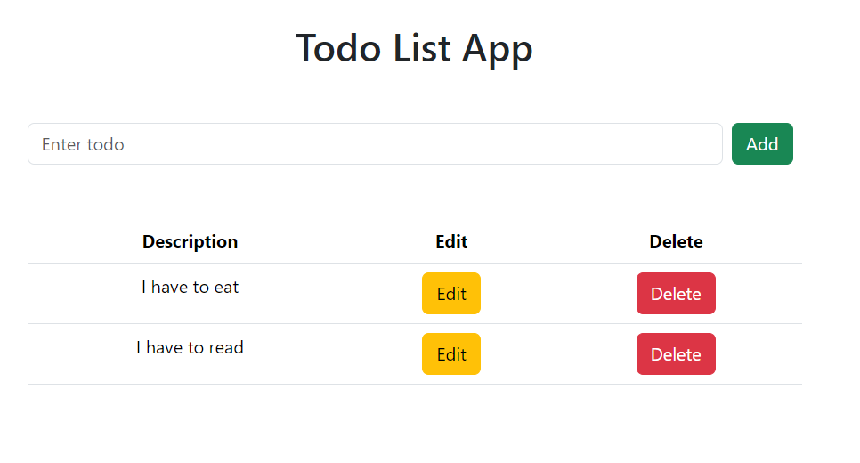

# Overview

A todo web application.

## Technologies Used

- **Frontend**: React.js
- **Backend**: Node.js, Express.js
- **Database**: Postgresql

## Frontend Layout

 

## Getting Started

To run the application locally, follow these steps:

1. Clone this repository to your local machine: `git clone https://github.com/KumaarBalbir/todo-postgres.git`
2. Navigate to the project directory: `cd todo-postgres`
3. Install dependencies for both the frontend and backend: for server side `cd server` and then `npm install` and for frontend side `cd client` and then `npm install`
4. Start backend server: `nodemon index.js`
6. Start frontend development server in separate terminal `npm start` (make sure you are in client directory)
7. Open your web browser and visit `http://localhost:3000` to access the todo application.

